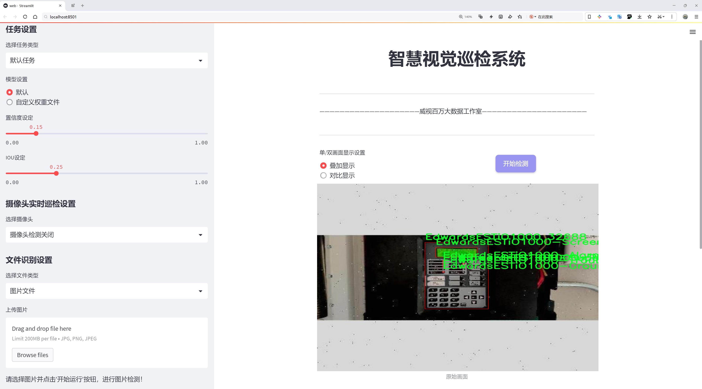
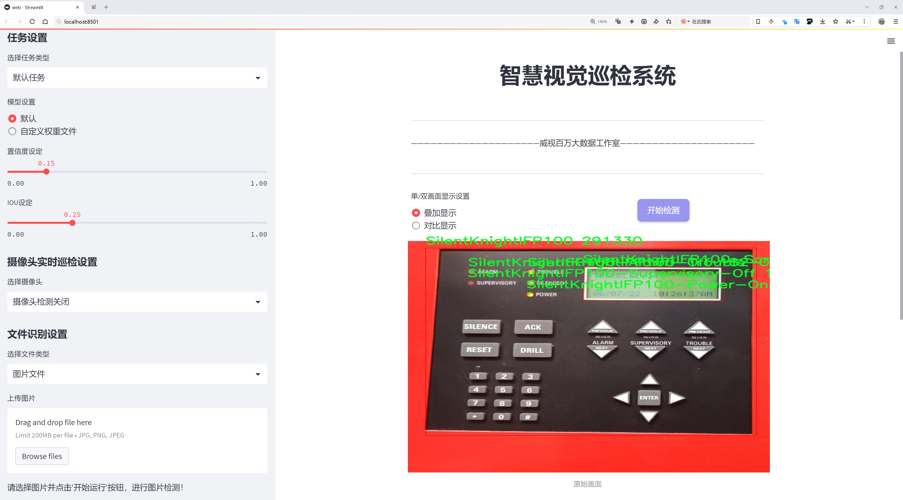
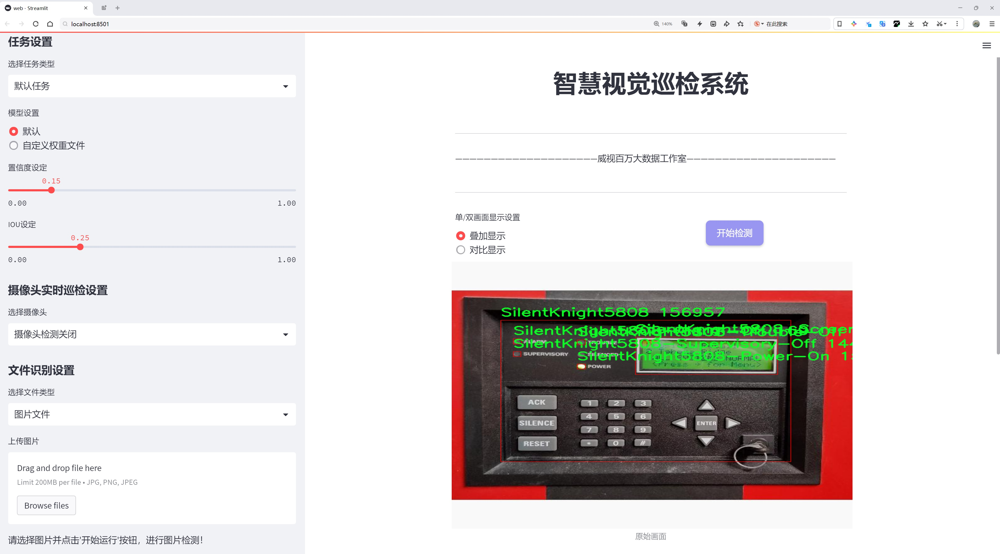
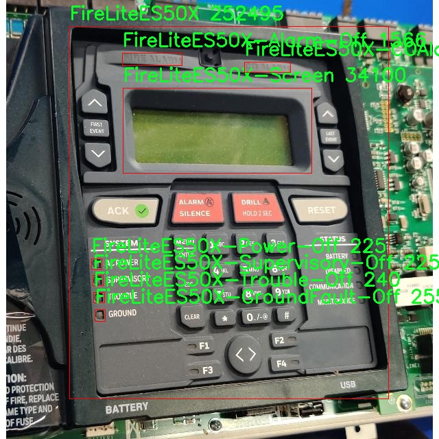
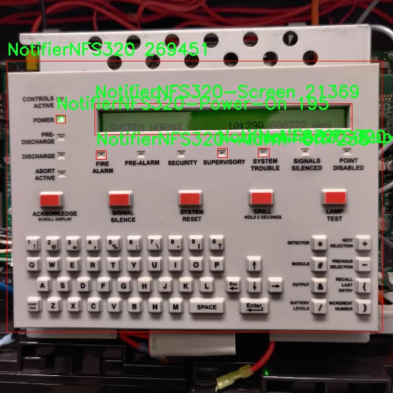
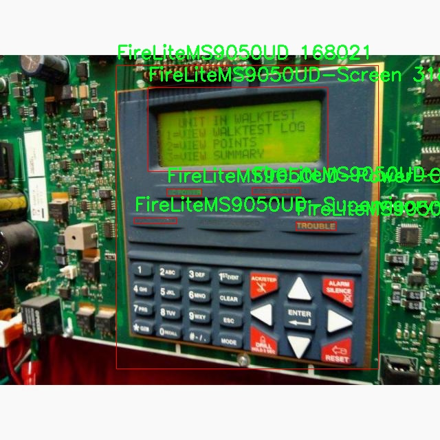
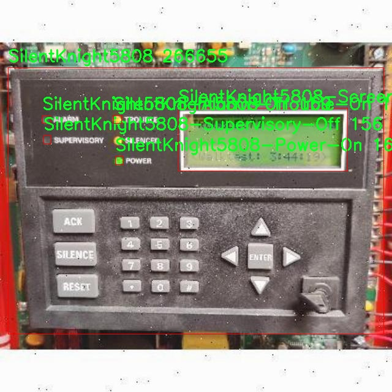
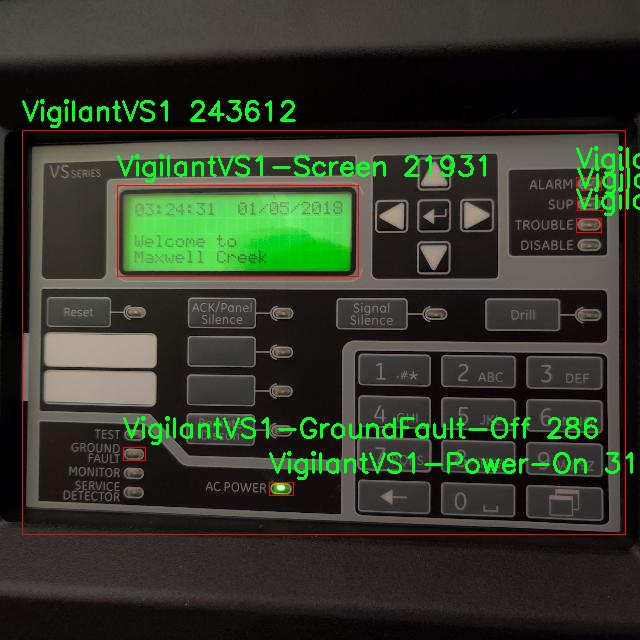

# 火灾报警器检测系统源码分享
 # [一条龙教学YOLOV8标注好的数据集一键训练_70+全套改进创新点发刊_Web前端展示]

### 1.研究背景与意义

项目参考[AAAI Association for the Advancement of Artificial Intelligence](https://gitee.com/qunmasj/projects)

研究背景与意义

火灾作为一种突发性灾害，给人们的生命财产安全带来了严重威胁。根据国际消防协会的统计数据，火灾每年造成的经济损失高达数十亿美元，同时也导致了大量的人员伤亡。因此，提升火灾报警系统的智能化水平，提高火灾检测的准确性和实时性，成为了当今社会亟待解决的重要课题。传统的火灾报警器虽然在一定程度上能够发挥作用，但其对环境变化的适应性差、误报率高等问题，使得其在实际应用中受到限制。因此，基于深度学习的图像识别技术，尤其是目标检测技术的应用，成为了火灾报警器检测系统研究的重要方向。

YOLO（You Only Look Once）系列模型因其高效的实时检测能力而受到广泛关注。YOLOv8作为该系列的最新版本，具备了更强的特征提取能力和更快的推理速度，适合在复杂环境中进行火灾报警器的检测。通过对YOLOv8模型的改进，可以进一步提升其在火灾报警器检测中的表现，尤其是在多类报警器的识别和状态判断方面。根据提供的数据集信息，该数据集包含4015张图像，涵盖了142个类别的火灾报警器，涉及多种状态（如报警、故障、正常等），为模型的训练和评估提供了丰富的样本。

在研究中，改进YOLOv8模型的意义不仅在于提升火灾报警器的检测精度，更在于推动智能火灾监测系统的发展。通过高效、准确的火灾报警器检测，能够实现对火灾隐患的早期预警，降低火灾发生的概率，进而保护人们的生命安全和财产安全。此外，智能火灾报警系统的应用，能够有效减轻消防人员的工作负担，提高火灾应急响应的效率，促进社会整体安全水平的提升。

本研究还具有重要的社会意义。随着城市化进程的加快，建筑物密集度不断增加，火灾风险也随之上升。通过建立高效的火灾报警器检测系统，能够为城市消防安全提供强有力的技术支持，助力智慧城市的建设。同时，基于深度学习的火灾报警器检测技术也可以为其他领域的智能监测提供借鉴，推动相关技术的交叉应用与发展。

综上所述，基于改进YOLOv8的火灾报警器检测系统的研究，不仅能够提升火灾报警器的检测性能，还将为社会的安全保障提供新的解决方案，具有重要的理论价值和实际应用意义。通过这一研究，期望能够为火灾防控领域的智能化发展贡献一份力量，为人们创造一个更加安全的生活环境。

### 2.图片演示







##### 注意：由于此博客编辑较早，上面“2.图片演示”和“3.视频演示”展示的系统图片或者视频可能为老版本，新版本在老版本的基础上升级如下：（实际效果以升级的新版本为准）

  （1）适配了YOLOV8的“目标检测”模型和“实例分割”模型，通过加载相应的权重（.pt）文件即可自适应加载模型。

  （2）支持“图片识别”、“视频识别”、“摄像头实时识别”三种识别模式。

  （3）支持“图片识别”、“视频识别”、“摄像头实时识别”三种识别结果保存导出，解决手动导出（容易卡顿出现爆内存）存在的问题，识别完自动保存结果并导出到。

  （4）支持Web前端系统中的标题、背景图等自定义修改，后面提供修改教程。

  另外本项目提供训练的数据集和训练教程,暂不提供权重文件（best.pt）,需要您按照教程进行训练后实现图片演示和Web前端界面演示的效果。

### 3.视频演示

[3.1 视频演示](https://www.bilibili.com/video/BV1kzWfe9E48/?vd_source=ff015de2d29cbe2a9cdbfa7064407a08)

### 4.数据集信息展示

数据集信息展示

本数据集名为“Go Fur It”，旨在为改进YOLOv8的火灾报警器检测系统提供支持。该数据集包含4015幅图像，涵盖了142个类别，专注于多种火灾报警器的状态和特征。这些图像的多样性和丰富性为模型的训练提供了坚实的基础，使其能够更好地识别和分类不同类型的火灾报警器及其工作状态。

在类别方面，数据集涵盖了多个知名品牌和型号的火灾报警器，包括Edwards、FireLite、Hochiki、Notifier、Siemens和Silent Knight等。这些品牌的报警器在市场上具有广泛的应用，涵盖了从家庭到工业环境的多种场景。具体来说，数据集中包括了如“EdwardsEST2”、“FireLiteES50X”、“NotifierNFW100”等多种型号，每个型号又细分为多个状态，例如“Alarm-On”、“Power-On”、“Trouble-Off”等。这种细致的分类使得模型能够在不同的工作状态下准确识别报警器，提升了系统的可靠性和响应速度。

数据集中的图像不仅数量庞大，而且在拍摄条件、角度和背景上也呈现出多样性。这种多样性确保了模型在实际应用中能够适应不同的环境和条件。例如，某些图像可能是在光线较暗的环境中拍摄，而另一些则是在明亮的条件下。这种环境变化的考虑，使得训练出的模型能够在各种实际场景中保持高效的检测能力。

此外，数据集的设计还考虑到了火灾报警器的不同状态对安全性的影响。通过对“Alarm-On”、“Trouble-On”等状态的标注，模型能够及时识别出潜在的安全隐患，从而为用户提供更为及时的警报。这对于火灾预防和应急响应至关重要，能够有效降低火灾带来的损失。

在数据集的使用上，研究人员和开发者可以利用这些图像进行深度学习模型的训练，特别是针对YOLOv8的优化。YOLOv8作为一种先进的目标检测模型，其高效性和准确性使其成为火灾报警器检测的理想选择。通过对本数据集的训练，模型能够学习到不同报警器的特征，从而在实际应用中实现快速、准确的检测。

总之，“Go Fur It”数据集为火灾报警器检测系统的改进提供了宝贵的资源。其丰富的图像数量、细致的类别划分以及多样的拍摄条件，使得模型的训练更加全面和高效。随着技术的不断进步和数据集的进一步完善，未来的火灾报警器检测系统将能够在更广泛的应用场景中发挥重要作用，保障人们的生命安全和财产安全。











### 5.全套项目环境部署视频教程（零基础手把手教学）

[5.1 环境部署教程链接（零基础手把手教学）](https://www.ixigua.com/7404473917358506534?logTag=c807d0cbc21c0ef59de5)


[5.2 安装Python虚拟环境创建和依赖库安装视频教程链接（零基础手把手教学）](https://www.ixigua.com/7404474678003106304?logTag=1f1041108cd1f708b01a)

### 6.手把手YOLOV8训练视频教程（零基础小白有手就能学会）

[6.1 环境部署教程链接（零基础手把手教学）](https://www.ixigua.com/7404477157818401292?logTag=d31a2dfd1983c9668658)

### 7.70+种全套YOLOV8创新点代码加载调参视频教程（一键加载写好的改进模型的配置文件）

[7.1 环境部署教程链接（零基础手把手教学）](https://www.ixigua.com/7404478314661806627?logTag=29066f8288e3f4eea3a4)

### 8.70+种全套YOLOV8创新点原理讲解（非科班也可以轻松写刊发刊，V10版本正在科研待更新）

由于篇幅限制，每个创新点的具体原理讲解就不一一展开，具体见下列网址中的创新点对应子项目的技术原理博客网址【Blog】：


[8.1 70+种全套YOLOV8创新点原理讲解链接](https://gitee.com/qunmasj/good)

### 9.系统功能展示（检测对象为举例，实际内容以本项目数据集为准）

图1.系统支持检测结果表格显示

  图2.系统支持置信度和IOU阈值手动调节

  图3.系统支持自定义加载权重文件best.pt(需要你通过步骤5中训练获得)

  图4.系统支持摄像头实时识别

  图5.系统支持图片识别

  图6.系统支持视频识别

  图7.系统支持识别结果文件自动保存

  图8.系统支持Excel导出检测结果数据


### 10.原始YOLOV8算法原理

原始YOLOv8算法原理

YOLOv8（You Only Look Once version 8）是计算机视觉领域中的一项重要创新，作为YOLO系列的最新版本，它在目标检测、分类和分割任务中展现出了卓越的性能。自2023年1月10日发布以来，YOLOv8凭借其高效的结构和强大的功能，迅速成为研究者和开发者的首选工具。其设计理念在于通过简化的工程化实现和高效的模型结构，提升目标检测的准确性和速度。

YOLOv8的核心结构主要由三个部分组成：Backbone、Neck和Head。Backbone负责特征提取，Neck用于特征融合，而Head则负责最终的目标检测。在Backbone部分，YOLOv8采用了CSPDarknet（Cross Stage Partial Darknet）结构，这一结构通过将特征图分为多个分支并进行处理，有效提升了特征提取的效率。相较于前代模型，YOLOv8引入了C2f模块替代了C3模块，C2f模块通过将输入特征图分为两个分支，分别经过卷积层进行降维，最终将这些分支的输出进行融合，形成更高维度的特征图。这种设计不仅增强了模型的梯度流信息，还提升了特征提取的多样性。

在特征融合方面，YOLOv8采用了快速空间金字塔池化（SPPF）结构。这一结构通过提取不同尺度的特征，有效减少了模型的参数量和计算量，同时提升了特征提取的效率。SPPF的引入使得YOLOv8能够在处理多尺度目标时表现得更加出色，尤其是在小目标检测和高分辨率图像处理方面。

YOLOv8的Head部分则是其最大的创新之一。与YOLOv5的Anchor-Based检测方式不同，YOLOv8采用了Anchor-Free的检测策略。这一策略通过直接预测目标的中心点及其宽高比例，显著减少了Anchor框的数量，从而提高了检测速度和准确度。传统的Anchor-Based方法往往需要预先定义多个Anchor框，这不仅增加了计算复杂度，还可能导致检测精度的下降。而YOLOv8的解耦头设计，使得分类和回归任务分开处理，进一步优化了模型的性能。

在损失函数的设计上，YOLOv8也进行了创新，旨在提高模型在不同任务上的表现。通过改进的损失函数，YOLOv8能够更好地适应各种目标检测和实例分割的需求，使得模型在训练过程中更加稳定，最终实现更高的mAP（mean Average Precision）指标。

此外，YOLOv8在硬件兼容性方面也做了大量优化，能够在从CPU到GPU的各种平台上高效运行。这一特性使得YOLOv8在实际应用中具备了更强的灵活性，能够满足不同场景下的需求。无论是在边缘设备还是高性能计算平台上，YOLOv8都能保持良好的性能表现。

值得一提的是，YOLOv8不仅在精度和速度上超越了前代模型，还在用户体验上进行了优化。其工程化设计使得模型的使用更加简便，用户可以轻松上手进行目标检测任务。通过提供易于理解的API和文档，YOLOv8为开发者提供了良好的支持，使得他们能够快速集成这一强大的工具到自己的项目中。

综上所述，YOLOv8作为YOLO系列的最新进展，通过对模型结构的深度优化和创新，展现出了卓越的性能。其在特征提取、特征融合、目标检测和损失函数等多个方面的改进，使得YOLOv8在计算机视觉领域中树立了新的标杆。无论是在学术研究还是实际应用中，YOLOv8都展现出了其强大的潜力，推动了目标检测技术的进一步发展。随着YOLOv8的不断应用和推广，未来的计算机视觉任务将更加高效和精准，为各行各业带来更大的便利和价值。


### 11.项目核心源码讲解（再也不用担心看不懂代码逻辑）

#### 11.1 ultralytics\data\explorer\__init__.py

下面是对给定代码的逐行分析和核心部分的保留，同时添加了详细的中文注释：

```python
# Ultralytics YOLO 🚀, AGPL-3.0 license

# 从当前包的 utils 模块中导入 plot_query_result 函数
from .utils import plot_query_result

# 定义模块的公共接口，只有 plot_query_result 函数会被导出
__all__ = ["plot_query_result"]
```

### 代码分析：
1. **导入模块**：
   - `from .utils import plot_query_result`：这行代码从当前包的 `utils` 模块中导入了 `plot_query_result` 函数。点号（`.`）表示当前包，确保在包的上下文中导入。

2. **定义公共接口**：
   - `__all__ = ["plot_query_result"]`：这行代码定义了模块的公共接口。`__all__` 是一个特殊的变量，当使用 `from module import *` 语句时，只有在 `__all__` 列表中的名称会被导入。这有助于控制模块的可见性，避免不必要的名称被导出。

### 核心部分：
- 该代码的核心在于导入 `plot_query_result` 函数并通过 `__all__` 变量控制模块的导出内容。这样做可以确保用户在使用该模块时，只能访问到预期的功能，保持模块的封装性和可维护性。

这个文件是一个Python模块的初始化文件，位于`ultralytics\data\explorer`目录下。文件的主要功能是导入和暴露模块中的特定功能。

首先，文件顶部的注释部分提到这是Ultralytics YOLO项目的一部分，并且该项目遵循AGPL-3.0许可证。这表明该项目是开源的，用户可以自由使用和修改，但需要遵循相应的许可证条款。

接下来，文件通过`from .utils import plot_query_result`语句从同一目录下的`utils`模块中导入了一个名为`plot_query_result`的函数。这意味着`plot_query_result`函数在这个模块中是可用的，并且可以被其他模块或脚本引用。

最后，`__all__`变量被定义为一个列表，包含了`"plot_query_result"`。这个变量的作用是控制当使用`from module import *`语句时，哪些名称会被导入。通过定义`__all__`，模块的作者可以明确指定哪些功能是公共的，哪些是内部使用的，从而提高代码的可读性和可维护性。

综上所述，这个初始化文件的主要作用是导入`plot_query_result`函数并将其暴露给外部使用，同时遵循开源许可证的规定。

#### 11.2 ultralytics\data\dataset.py

以下是代码中最核心的部分，并附上详细的中文注释：

```python
import numpy as np
import torch
from pathlib import Path
from ultralytics.utils import TQDM, get_hash, img2label_paths, LOGGER
from .base import BaseDataset

# Ultralytics 数据集缓存版本，>= 1.0.0 用于 YOLOv8
DATASET_CACHE_VERSION = "1.0.3"

class YOLODataset(BaseDataset):
    """
    YOLO 数据集类，用于加载 YOLO 格式的目标检测和/或分割标签。

    Args:
        data (dict, optional): 数据集 YAML 字典。默认为 None。
        task (str): 明确指向当前任务的参数，默认为 'detect'。
    """

    def __init__(self, *args, data=None, task="detect", **kwargs):
        """初始化 YOLODataset，包含可选的段和关键点配置。"""
        self.use_segments = task == "segment"  # 是否使用分割
        self.use_keypoints = task == "pose"     # 是否使用关键点
        self.data = data
        assert not (self.use_segments and self.use_keypoints), "不能同时使用分割和关键点。"  # 断言检查
        super().__init__(*args, **kwargs)

    def cache_labels(self, path=Path("./labels.cache")):
        """
        缓存数据集标签，检查图像并读取形状。

        Args:
            path (Path): 保存缓存文件的路径（默认: Path('./labels.cache')）。
        Returns:
            (dict): 标签字典。
        """
        x = {"labels": []}  # 初始化标签字典
        nm, nf, ne, nc, msgs = 0, 0, 0, 0, []  # 统计缺失、找到、空、损坏的数量和消息
        total = len(self.im_files)  # 图像文件总数

        # 使用多线程池并行处理图像标签验证
        with ThreadPool(NUM_THREADS) as pool:
            results = pool.imap(
                func=verify_image_label,
                iterable=zip(
                    self.im_files,
                    self.label_files,
                    repeat(self.prefix),
                    repeat(self.use_keypoints),
                    repeat(len(self.data["names"])),
                ),
            )
            pbar = TQDM(results, desc="扫描中...", total=total)  # 进度条显示
            for im_file, lb, shape, segments, keypoint, nm_f, nf_f, ne_f, nc_f, msg in pbar:
                nm += nm_f
                nf += nf_f
                ne += ne_f
                nc += nc_f
                if im_file:
                    x["labels"].append(
                        dict(
                            im_file=im_file,
                            shape=shape,
                            cls=lb[:, 0:1],  # 类别
                            bboxes=lb[:, 1:],  # 边界框
                            segments=segments,
                            keypoints=keypoint,
                            normalized=True,
                            bbox_format="xywh",
                        )
                    )
                if msg:
                    msgs.append(msg)
                pbar.desc = f"扫描中... {nf} 图像, {nm + ne} 背景, {nc} 损坏"
            pbar.close()

        if msgs:
            LOGGER.info("\n".join(msgs))  # 记录警告信息
        x["hash"] = get_hash(self.label_files + self.im_files)  # 生成标签文件和图像文件的哈希值
        save_dataset_cache_file(self.prefix, path, x)  # 保存缓存文件
        return x

    def get_labels(self):
        """返回 YOLO 训练的标签字典。"""
        self.label_files = img2label_paths(self.im_files)  # 获取标签文件路径
        cache_path = Path(self.label_files[0]).parent.with_suffix(".cache")  # 缓存文件路径
        try:
            cache, exists = load_dataset_cache_file(cache_path), True  # 尝试加载缓存文件
            assert cache["version"] == DATASET_CACHE_VERSION  # 检查版本
            assert cache["hash"] == get_hash(self.label_files + self.im_files)  # 检查哈希值
        except (FileNotFoundError, AssertionError):
            cache, exists = self.cache_labels(cache_path), False  # 如果加载失败，则运行缓存操作

        # 显示缓存结果
        nf, nm, ne, nc, n = cache.pop("results")  # 提取结果
        if exists:
            d = f"扫描 {cache_path}... {nf} 图像, {nm + ne} 背景, {nc} 损坏"
            TQDM(None, desc=self.prefix + d, total=n, initial=n)  # 显示结果
            if cache["msgs"]:
                LOGGER.info("\n".join(cache["msgs"]))  # 显示警告

        # 读取缓存
        labels = cache["labels"]
        if not labels:
            LOGGER.warning(f"警告 ⚠️ 在 {cache_path} 中未找到图像，训练可能无法正常工作。")
        self.im_files = [lb["im_file"] for lb in labels]  # 更新图像文件列表
        return labels  # 返回标签

    @staticmethod
    def collate_fn(batch):
        """将数据样本合并为批次。"""
        new_batch = {}
        keys = batch[0].keys()  # 获取批次中的键
        values = list(zip(*[list(b.values()) for b in batch]))  # 转置批次数据
        for i, k in enumerate(keys):
            value = values[i]
            if k == "img":
                value = torch.stack(value, 0)  # 堆叠图像
            if k in ["masks", "keypoints", "bboxes", "cls", "segments", "obb"]:
                value = torch.cat(value, 0)  # 合并其他数据
            new_batch[k] = value
        return new_batch  # 返回合并后的批次
```

### 代码核心部分说明：
1. **YOLODataset 类**：该类用于加载和处理 YOLO 格式的数据集，支持目标检测和分割任务。
2. **cache_labels 方法**：负责缓存标签，检查图像的有效性，并记录相关信息。
3. **get_labels 方法**：获取标签信息，支持从缓存中加载数据，确保数据的完整性和一致性。
4. **collate_fn 方法**：将多个样本合并为一个批次，适用于模型训练。

这些部分是 YOLO 数据集处理的核心逻辑，确保数据的有效性和可用性。

这个程序文件主要定义了用于加载和处理YOLO格式的数据集的类和方法，适用于目标检测和分割任务。首先，文件导入了一些必要的库，包括多线程处理、图像处理、深度学习框架PyTorch等。接着，定义了一个名为`YOLODataset`的类，继承自`BaseDataset`，用于加载YOLO格式的对象检测和分割标签。

在`YOLODataset`类的构造函数中，可以通过参数指定数据集的类型（检测、分割或姿态估计），并且会检查是否同时使用分割和关键点，避免冲突。类中有一个`cache_labels`方法，用于缓存数据集标签，检查图像并读取其形状。这个方法会创建一个包含标签信息的字典，并通过多线程处理提高效率。

`get_labels`方法用于返回YOLO训练所需的标签字典。它会尝试加载缓存文件，如果缓存文件不存在或不匹配，则调用`cache_labels`方法进行缓存操作。接着，方法会检查标签的完整性，并根据需要更新图像文件列表。

`build_transforms`方法用于构建数据增强的转换操作，支持不同的增强策略。`close_mosaic`方法则用于关闭马赛克增强，确保在训练时只使用基础的转换。

`update_labels_info`方法用于自定义标签格式，处理边界框、分割和关键点信息，并将其转换为`Instances`对象。`collate_fn`方法用于将数据样本合并成批次，以便于训练。

此外，文件中还定义了一个`ClassificationDataset`类，继承自`torchvision.datasets.ImageFolder`，用于处理YOLO分类数据集。该类支持图像的缓存、增强和验证，确保数据集的完整性。

最后，文件提供了两个辅助函数`load_dataset_cache_file`和`save_dataset_cache_file`，用于加载和保存数据集的缓存文件，优化数据读取的效率。

整体来看，这个文件实现了YOLO数据集的加载、处理和增强功能，为训练YOLO模型提供了基础设施。

#### 11.3 ui.py

```python
import sys
import subprocess

def run_script(script_path):
    """
    使用当前 Python 环境运行指定的脚本。

    Args:
        script_path (str): 要运行的脚本路径

    Returns:
        None
    """
    # 获取当前 Python 解释器的路径
    python_path = sys.executable

    # 构建运行命令，使用 streamlit 运行指定的脚本
    command = f'"{python_path}" -m streamlit run "{script_path}"'

    # 执行命令并等待其完成
    result = subprocess.run(command, shell=True)
    
    # 检查命令执行的返回码，如果不为0，表示出错
    if result.returncode != 0:
        print("脚本运行出错。")


# 主程序入口
if __name__ == "__main__":
    # 指定要运行的脚本路径
    script_path = "web.py"  # 这里可以直接使用相对路径

    # 调用函数运行脚本
    run_script(script_path)
```

### 代码注释说明：
1. **导入模块**：
   - `sys`：用于获取当前 Python 解释器的路径。
   - `subprocess`：用于执行外部命令。

2. **定义 `run_script` 函数**：
   - 接受一个参数 `script_path`，表示要运行的 Python 脚本的路径。
   - 使用 `sys.executable` 获取当前 Python 解释器的路径，以便在命令中调用。

3. **构建命令**：
   - 使用 `f-string` 格式化字符串，构建一个命令来运行 `streamlit`，并指定要执行的脚本。

4. **执行命令**：
   - 使用 `subprocess.run` 执行构建的命令，并设置 `shell=True` 以便在 shell 中运行。
   - 检查命令的返回码，如果返回码不为0，表示执行过程中出现错误，打印错误信息。

5. **主程序入口**：
   - 使用 `if __name__ == "__main__":` 确保该部分代码仅在直接运行脚本时执行。
   - 指定要运行的脚本路径（在这里是 `web.py`），然后调用 `run_script` 函数来执行该脚本。

这个程序文件的主要功能是使用当前的 Python 环境来运行一个指定的脚本，具体是通过 Streamlit 来启动一个 Web 应用。程序的开头部分导入了必要的模块，包括 `sys`、`os` 和 `subprocess`，以及一个自定义的 `abs_path` 函数，用于获取脚本的绝对路径。

在 `run_script` 函数中，首先获取当前 Python 解释器的路径，这样可以确保在正确的环境中运行脚本。接着，构建一个命令字符串，该命令使用 Streamlit 来运行指定的脚本。这里使用了 `-m streamlit run` 的方式来调用 Streamlit，这意味着将会启动一个 Web 应用。

随后，使用 `subprocess.run` 来执行这个命令。这个函数会在新的 shell 中运行命令，并等待其完成。如果命令执行的返回码不为零，表示脚本运行出错，程序会打印出相应的错误信息。

在文件的最后部分，使用 `if __name__ == "__main__":` 语句来确保只有在直接运行该脚本时才会执行下面的代码。在这里，指定了要运行的脚本路径为 `web.py`，并调用 `run_script` 函数来启动这个脚本。

总体来说，这个程序提供了一种简便的方式来启动一个基于 Streamlit 的 Web 应用，确保在当前 Python 环境中执行，并处理可能出现的错误。

#### 11.4 train.py

以下是代码中最核心的部分，并附上详细的中文注释：

```python
import os
import torch
import yaml
from ultralytics import YOLO  # 导入YOLO模型库
from QtFusion.path import abs_path  # 导入路径处理函数

# 确定使用的设备，如果有可用的GPU则使用GPU，否则使用CPU
device = "0" if torch.cuda.is_available() else "cpu"

if __name__ == '__main__':  # 确保该模块被直接运行时才执行以下代码
    workers = 1  # 设置数据加载的工作进程数
    batch = 2    # 设置每个批次的大小

    data_name = "data"  # 数据集名称
    # 获取数据集配置文件的绝对路径
    data_path = abs_path(f'datasets/{data_name}/{data_name}.yaml', path_type='current')  
    unix_style_path = data_path.replace(os.sep, '/')  # 将路径转换为Unix风格

    # 获取数据集目录路径
    directory_path = os.path.dirname(unix_style_path)
    
    # 读取YAML格式的数据集配置文件
    with open(data_path, 'r') as file:
        data = yaml.load(file, Loader=yaml.FullLoader)
    
    # 如果配置文件中有'path'项，则修改为当前目录路径
    if 'path' in data:
        data['path'] = directory_path
        # 将修改后的数据写回YAML文件
        with open(data_path, 'w') as file:
            yaml.safe_dump(data, file, sort_keys=False)

    # 加载YOLOv8模型，指定模型配置文件和任务类型
    model = YOLO(model='./ultralytics/cfg/models/v8/yolov8s.yaml', task='detect')  
    
    # 开始训练模型
    results2 = model.train(  
        data=data_path,  # 指定训练数据的配置文件路径
        device=device,  # 指定使用的设备
        workers=workers,  # 指定数据加载的工作进程数
        imgsz=640,  # 指定输入图像的大小为640x640
        epochs=100,  # 指定训练的轮数为100
        batch=batch,  # 指定每个批次的大小
        name='train_v8_' + data_name  # 指定训练任务的名称
    )
```

### 代码核心部分解释：
1. **设备选择**：根据是否有可用的GPU，选择使用GPU或CPU进行模型训练。
2. **数据集路径处理**：通过`abs_path`函数获取数据集配置文件的绝对路径，并确保路径格式为Unix风格。
3. **YAML文件读取与修改**：读取数据集的YAML配置文件，更新其中的`path`项为当前目录路径，并将修改后的内容写回文件。
4. **模型加载与训练**：加载YOLOv8模型并开始训练，指定训练所需的参数，包括数据路径、设备、工作进程数、图像大小、训练轮数和批次大小。

该程序文件`train.py`的主要功能是使用YOLOv8模型进行目标检测的训练。首先，程序导入了必要的库，包括`os`、`torch`、`yaml`和`ultralytics`中的YOLO模型。接着，程序判断当前是否可以使用GPU，如果可以，则将设备设置为"0"（表示使用第一个GPU），否则使用CPU。

在`__main__`模块中，程序设置了一些训练参数，包括工作进程数（`workers`）和批次大小（`batch`）。接下来，程序定义了数据集的名称为`data`，并构建了数据集配置文件的绝对路径。这里使用了`abs_path`函数来获取路径，并将路径中的分隔符统一为Unix风格。

程序随后获取了数据集配置文件所在的目录路径，并打开该YAML文件以读取数据。读取后，程序检查YAML文件中是否包含`path`项，如果有，则将其修改为当前目录路径，并将修改后的内容写回到YAML文件中，以确保模型可以正确找到数据集。

接下来，程序加载了YOLOv8的预训练模型，指定了模型的配置文件。然后，程序调用`model.train()`方法开始训练模型。在训练过程中，程序指定了训练数据的配置文件路径、设备、工作进程数、输入图像的大小（640x640）、训练的epoch数量（100）以及训练任务的名称。

整体来看，该程序实现了YOLOv8模型的训练流程，涵盖了数据集路径的处理、模型的加载和训练参数的设置等关键步骤。

#### 11.5 ultralytics\models\fastsam\utils.py

以下是代码中最核心的部分，并附上详细的中文注释：

```python
import torch

def adjust_bboxes_to_image_border(boxes, image_shape, threshold=20):
    """
    调整边界框，使其在距离图像边界一定阈值内时，贴合图像边界。

    参数:
        boxes (torch.Tensor): 边界框的坐标，形状为 (n, 4)
        image_shape (tuple): 图像的高度和宽度，形状为 (height, width)
        threshold (int): 像素阈值

    返回:
        adjusted_boxes (torch.Tensor): 调整后的边界框
    """

    # 获取图像的高度和宽度
    h, w = image_shape

    # 调整边界框的位置
    boxes[boxes[:, 0] < threshold, 0] = 0  # 将左上角 x 坐标小于阈值的调整为 0
    boxes[boxes[:, 1] < threshold, 1] = 0  # 将左上角 y 坐标小于阈值的调整为 0
    boxes[boxes[:, 2] > w - threshold, 2] = w  # 将右下角 x 坐标大于图像宽度减去阈值的调整为图像宽度
    boxes[boxes[:, 3] > h - threshold, 3] = h  # 将右下角 y 坐标大于图像高度减去阈值的调整为图像高度
    return boxes


def bbox_iou(box1, boxes, iou_thres=0.9, image_shape=(640, 640), raw_output=False):
    """
    计算一个边界框与其他边界框的交并比（IoU）。

    参数:
        box1 (torch.Tensor): 单个边界框的坐标，形状为 (4, )
        boxes (torch.Tensor): 一组边界框的坐标，形状为 (n, 4)
        iou_thres (float): IoU 阈值
        image_shape (tuple): 图像的高度和宽度，形状为 (height, width)
        raw_output (bool): 如果为 True，则返回原始 IoU 值而不是索引

    返回:
        high_iou_indices (torch.Tensor): IoU 大于阈值的边界框索引
    """
    # 调整边界框，使其贴合图像边界
    boxes = adjust_bboxes_to_image_border(boxes, image_shape)

    # 计算交集的坐标
    x1 = torch.max(box1[0], boxes[:, 0])  # 交集左上角 x 坐标
    y1 = torch.max(box1[1], boxes[:, 1])  # 交集左上角 y 坐标
    x2 = torch.min(box1[2], boxes[:, 2])  # 交集右下角 x 坐标
    y2 = torch.min(box1[3], boxes[:, 3])  # 交集右下角 y 坐标

    # 计算交集的面积
    intersection = (x2 - x1).clamp(0) * (y2 - y1).clamp(0)

    # 计算两个边界框的面积
    box1_area = (box1[2] - box1[0]) * (box1[3] - box1[1])  # box1 的面积
    box2_area = (boxes[:, 2] - boxes[:, 0]) * (boxes[:, 3] - boxes[:, 1])  # boxes 的面积

    # 计算并集的面积
    union = box1_area + box2_area - intersection

    # 计算 IoU
    iou = intersection / union  # IoU 值，形状为 (n, )
    if raw_output:
        return 0 if iou.numel() == 0 else iou  # 如果需要原始 IoU 值，则返回

    # 返回 IoU 大于阈值的边界框索引
    return torch.nonzero(iou > iou_thres).flatten()
```

### 代码说明：
1. **`adjust_bboxes_to_image_border` 函数**：该函数用于调整边界框的位置，使其在距离图像边界一定的阈值内时，贴合图像的边界。这对于确保边界框不会超出图像边界是非常重要的。

2. **`bbox_iou` 函数**：该函数计算一个边界框与一组其他边界框之间的交并比（IoU）。IoU 是目标检测中常用的指标，用于评估预测框与真实框的重叠程度。函数首先调用 `adjust_bboxes_to_image_border` 来调整边界框，然后计算交集和并集的面积，最后返回满足 IoU 阈值的边界框索引。

这个程序文件是用于处理目标检测中的边界框（bounding boxes）的工具，主要包含两个函数：`adjust_bboxes_to_image_border`和`bbox_iou`。

`adjust_bboxes_to_image_border`函数的作用是调整边界框的位置，使其在图像边界内。如果边界框的某个边距图像边界的距离小于指定的阈值（默认为20像素），则将该边界框的相应坐标调整到图像的边界上。该函数接受三个参数：`boxes`是一个形状为(n, 4)的张量，表示n个边界框的坐标；`image_shape`是一个元组，包含图像的高度和宽度；`threshold`是一个整数，表示允许的像素阈值。函数返回调整后的边界框。

`bbox_iou`函数用于计算一个边界框与一组其他边界框之间的交并比（IoU）。它接受五个参数：`box1`是一个形状为(4,)的张量，表示待比较的边界框；`boxes`是一个形状为(n, 4)的张量，表示一组边界框；`iou_thres`是一个浮点数，表示IoU的阈值；`image_shape`是图像的高度和宽度；`raw_output`是一个布尔值，指示是否返回原始的IoU值。该函数首先调用`adjust_bboxes_to_image_border`来确保所有边界框都在图像边界内，然后计算交集的坐标，进而计算交集的面积、各个边界框的面积和并集的面积，最后计算IoU值。如果`raw_output`为True，则返回IoU值；否则，返回与IoU大于阈值的边界框的索引。

总体来说，这个文件提供了边界框调整和IoU计算的功能，常用于目标检测任务中，以确保边界框的有效性和准确性。

#### 11.6 ultralytics\models\fastsam\__init__.py

以下是代码中最核心的部分，并附上详细的中文注释：

```python
# 导入必要的模块和类
from .model import FastSAM  # 从当前包中导入 FastSAM 模型类
from .predict import FastSAMPredictor  # 从当前包中导入 FastSAMPredictor 类，用于进行预测
from .prompt import FastSAMPrompt  # 从当前包中导入 FastSAMPrompt 类，用于处理提示信息
from .val import FastSAMValidator  # 从当前包中导入 FastSAMValidator 类，用于验证模型性能

# 定义模块的公开接口，指定可以被外部访问的类
__all__ = "FastSAMPredictor", "FastSAM", "FastSAMPrompt", "FastSAMValidator"
```

### 代码注释说明：
1. **导入模块**：
   - `from .model import FastSAM`：导入 `FastSAM` 类，这通常是一个模型的定义，负责处理与模型相关的操作。
   - `from .predict import FastSAMPredictor`：导入 `FastSAMPredictor` 类，该类可能包含方法来执行模型的预测任务。
   - `from .prompt import FastSAMPrompt`：导入 `FastSAMPrompt` 类，可能用于处理用户输入或提示信息，以便更好地与模型交互。
   - `from .val import FastSAMValidator`：导入 `FastSAMValidator` 类，通常用于评估模型的性能，确保模型在测试集上的表现符合预期。

2. **定义公开接口**：
   - `__all__` 变量定义了模块的公共接口，只有在使用 `from module import *` 时，列出的类会被导入。这是一种控制模块导出内容的方式，确保用户只访问到模块的核心部分。

这个程序文件是一个Python模块的初始化文件，通常用于定义模块的公共接口和导入相关的类或函数。在这个特定的文件中，主要涉及到与Ultralytics YOLO相关的FastSAM模型。

首先，文件开头有一个注释，指出这是Ultralytics YOLO的代码，并且遵循AGPL-3.0许可证。这意味着该代码是开源的，用户可以自由使用和修改，但需要遵循相应的许可证条款。

接下来，文件通过相对导入的方式引入了四个组件：`FastSAM`、`FastSAMPredictor`、`FastSAMPrompt`和`FastSAMValidator`。这些组件分别位于同一模块的不同文件中。具体来说：

- `FastSAM`：可能是一个模型类，负责定义和实现FastSAM算法的核心功能。
- `FastSAMPredictor`：这个类可能用于进行预测，利用已经训练好的FastSAM模型对输入数据进行推断。
- `FastSAMPrompt`：这个类可能涉及到与用户交互的部分，比如接收用户输入的提示信息，帮助模型更好地理解任务。
- `FastSAMValidator`：这个类可能用于验证模型的性能，评估其在不同数据集上的表现。

最后，`__all__`变量定义了模块的公共接口，指定了在使用`from module import *`时，哪些名称会被导入。这里列出的四个组件都被包含在内，意味着它们是该模块的主要功能部分，用户可以直接使用这些类而无需了解模块内部的实现细节。

总体而言，这个初始化文件的主要作用是组织和暴露FastSAM相关的功能，使得用户能够方便地使用这些类来进行模型的训练、预测和验证等操作。

### 12.系统整体结构（节选）

### 整体功能和构架概括

该项目是一个基于Ultralytics YOLO框架的目标检测和分割系统，主要功能包括数据集的加载与处理、模型的训练与预测、以及结果的可视化。项目结构清晰，模块化设计使得各个功能部分独立且易于维护。主要包括以下几个部分：

1. **数据处理**：负责加载和处理数据集，包括YOLO格式的标签和图像，提供数据增强和缓存功能。
2. **模型训练**：实现YOLO模型的训练流程，设置训练参数，处理数据集路径，确保模型可以正确找到数据。
3. **模型预测**：提供模型推断的功能，能够对输入数据进行实时预测。
4. **工具函数**：提供一些辅助功能，如边界框的调整和IoU计算等，帮助实现目标检测的基本操作。
5. **用户界面**：通过Streamlit等工具提供用户交互界面，方便用户进行模型训练和预测。

### 文件功能整理表

| 文件路径                                                | 功能描述                                                                 |
|-------------------------------------------------------|--------------------------------------------------------------------------|
| `ultralytics\data\explorer\__init__.py`              | 初始化模块，导入并暴露`plot_query_result`函数，用于结果可视化。        |
| `ultralytics\data\dataset.py`                         | 定义`YOLODataset`和`ClassificationDataset`类，处理数据集的加载和增强。 |
| `ui.py`                                              | 启动Streamlit Web应用，运行指定的脚本以提供用户界面。                  |
| `train.py`                                           | 实现YOLO模型的训练流程，设置训练参数并处理数据集路径。                |
| `ultralytics\models\fastsam\utils.py`                | 提供边界框调整和IoU计算的工具函数，支持目标检测任务。                 |
| `ultralytics\models\fastsam\__init__.py`             | 初始化FastSAM模块，导入相关类（如`FastSAM`、`FastSAMPredictor`等）。   |
| `ultralytics\assets\utils\__init__.py`               | 初始化工具模块，可能包含一些通用的辅助函数（具体功能未分析）。         |
| `ultralytics\models\fastsam\predict.py`              | 处理FastSAM模型的预测功能，利用训练好的模型进行推断（具体功能未分析）。 |
| `ultralytics\models\yolo\classify\__init__.py`      | 初始化YOLO分类模块，可能包含分类相关的功能（具体功能未分析）。         |
| `ultralytics\trackers\utils\gmc.py`                  | 提供与跟踪相关的工具函数，可能涉及图像处理和跟踪算法（具体功能未分析）。 |

这个表格总结了每个文件的主要功能，帮助理解整个项目的结构和各个模块之间的关系。

注意：由于此博客编辑较早，上面“11.项目核心源码讲解（再也不用担心看不懂代码逻辑）”中部分代码可能会优化升级，仅供参考学习，完整“训练源码”、“Web前端界面”和“70+种创新点源码”以“13.完整训练+Web前端界面+70+种创新点源码、数据集获取”的内容为准。

### 13.完整训练+Web前端界面+70+种创新点源码、数据集获取


#完整训练+Web前端界面+70+种创新点源码、数据集获取链接

https://mbd.pub/o/bread/ZpqUl5dw